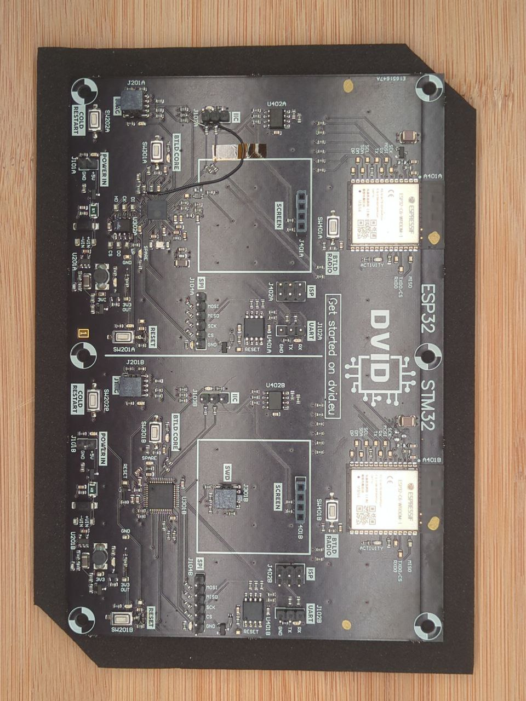

# DVID v2 - Opensource space

Welcome to the DVID V2 opensource space.

The DVID board is currently in beta mode. You can request an access to beta program on contact@dvid.eu.

## Contribution
### Introduction
Because the DVID project is opensource, you are more than welcome to contribute. We happily accept new trainings, CTF challenges and proof-of-concepts.

### Instructions
If you want to contribute, please follow these steps :
* Clone this repo
* Create a new branch with an explicit name
* Push your contribution to this new branch
* Request a merge request on the main branch of this repo
* After review, your contribution will be added

### Rules
Your contribution needs to respect the following rules :
* Each trainings needs to end with a flag (DVID-XXXXXX)
* The solution needs to be detailed but the flag must not be given
* The training or challenge needs to be in a docker environment. Docker-compose is accepted, but only if the configuration of a single docker is not possible. Access to the game environment must be local, on the player's workstation.
