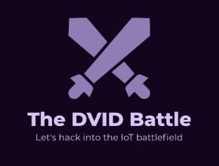

# The DVID Battle Experience

Welcome challenger. On this repository, you will find all details about the challenge.

## Communication
For all questions, you can contact us on battleexperience@dvid.eu.
Related to public communication, all medias are available on ./communication folder.
Public stream will be done on twitch platform.

## Concept
The DVID battle experience unifies two university around a hardware challenge.
Each university will create and develop a challenge that the challenger will try to solve. The first blood declares the corresponding university winner.

## Rules
* One week (7 days) will be spent to create and develop the challenge
* One week (7 days) will be spent to verify both challenge and exchange board between university
* One week (7 days) will be spent to solve the challenge
* No limitation will be implemented on team members (number and skills)

## Price
The winner will get two annual licence of DVID platform. Each licence will give full access to 300 IoT trainings that help to improve skills and technical knowledge in IoT cybersecurity world.

The winner will have possibility to define new rules on a future battle challenge (with approval of DVID team).

## Wall of winners
Yet, there is no winners.

## Write-up of past challenges
All challenges (and step-by-step write-up) are available after winner announcement. They will be added in the edition folder.
