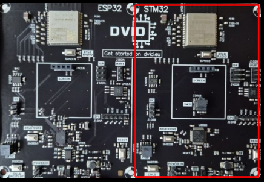
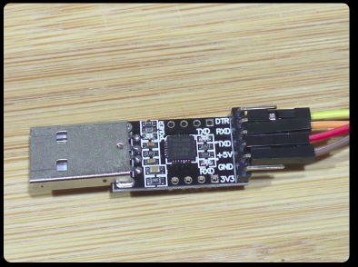
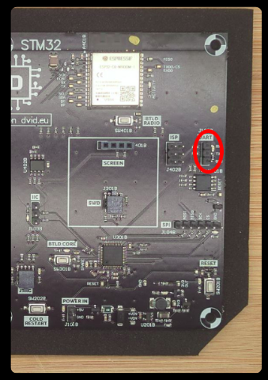
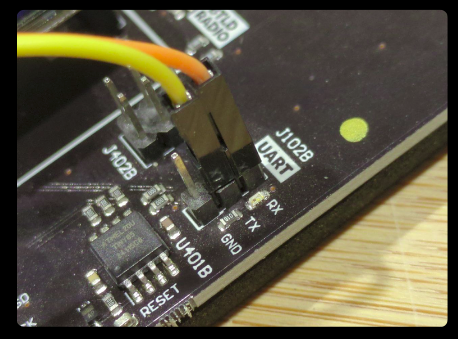
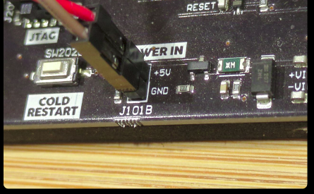
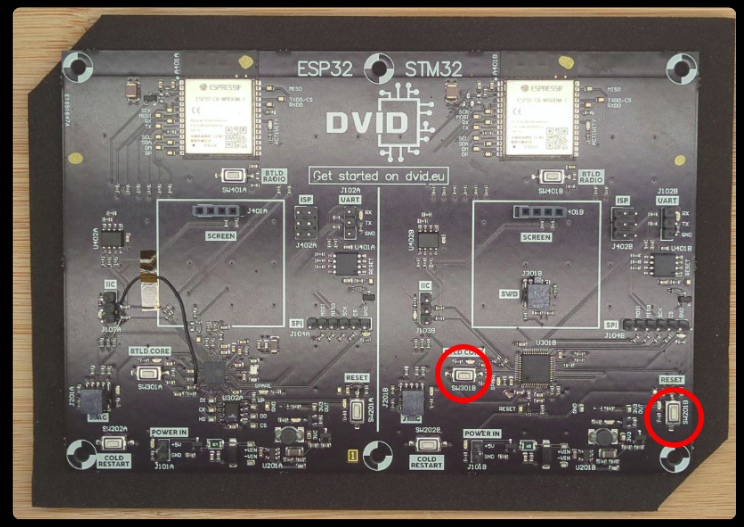
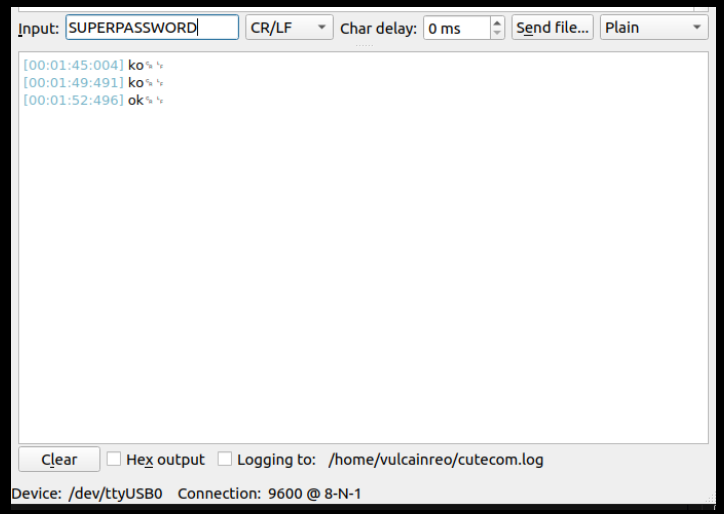

# THCON 2025 - DVID/WOCSA Workshop
This workshop takes place at ENSEIHT in Toulouse on the 10th & 11th of April 2025.

## Credit

This workshop is in collaboration with:
* DVID : https://dvid.eu
* Wocsa : https://wocsa.org
* Cyblex Consulting : https://www.cyblex-consulting.com/

## Workshop

Slides of the workshop are available here : [Slides](./thcon2025_workshopDVID.pdf)

### Workshop #1
This workshop will focus on STM32 side (right) of the DVID board and explore UART protocol.

#### Objective
Wire correctly UART to the STM32 MCU
Dump firmware to local computer
Analyze the firmware to find useful information
Pass the password through UART dongle

Let's take the right side of the DVID board. This side is powered by STM32F103 MCU locate on the bottom.

#### Flash
If you need to flash the board, the firmware is available here [firmware](./uart/firmware.bin)

#### Stage 1



Because the training uses UART protocol, you need to take an UART dongle.



On the DVID board, locate the UART pin. They are at top on the right. RX for data reception and TX for data transmission



The next step is to wiring the UART dongle with the board. Remeber that you send a data from a side to receive it on the second side. So you need to cross wires between the board and the dongle.


If UART is correctly wire, you can wire power. Be careful to not invert pins.



You can press "RESET" button to start the training.

#### Stage 2
xx




```bash
Arduino_STM32/tools/linux64/stm32flash/stm32flash -b 115200 -r test.bin /dev/ttyUSB0
```

```bash
strings test.bin | grep -i pass

Pass from UART ?
SUPERPASSWORD
````

#### Stage 3

Reset the board to restart the training

Take cutecom programm to submit the password to the board.



**Well done !**
