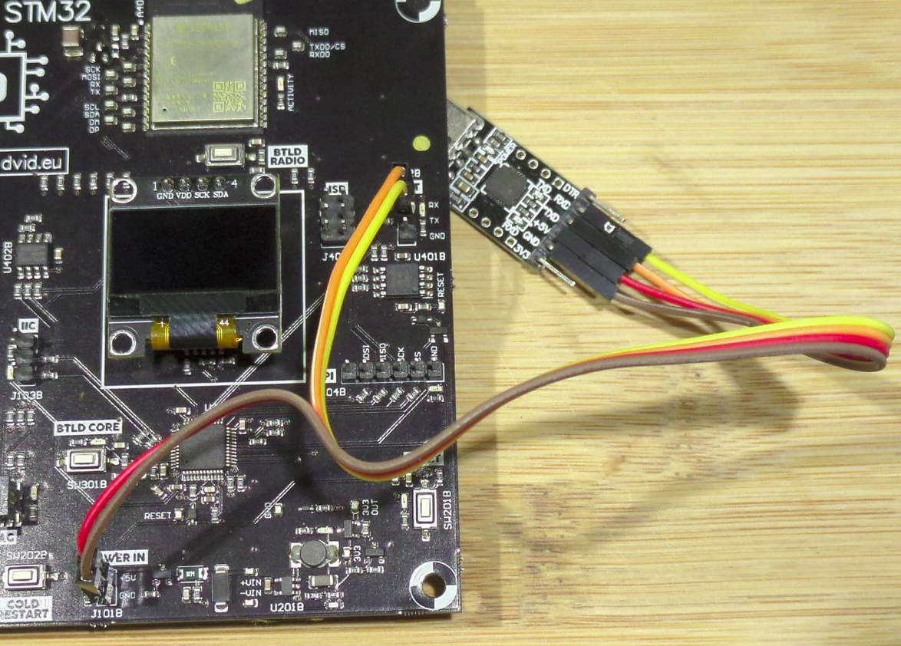
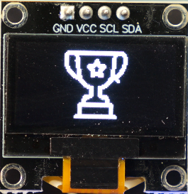

# THCON 2025 - DVID/WOCSA Workshop
This workshop takes place at ENSEIHT in Toulouse on the 10th & 11th of April 2025.

Many thanks to WOCSA team to lead this workshop.

## Credit

This workshop is in collaboration with:
* DVID : https://dvid.eu
* Wocsa : https://wocsa.org
* Cyblex Consulting : https://www.cyblex-consulting.com/

## Workshop

Slides of the workshop are available here : [Slides](./thcon2025_workshopDVID_WOCSA.pdf)

### Workshop #1
This workshop will focus on STM32 side (right) of the DVID board and explore UART protocol.

#### Objective
Wire correctly UART to the STM32 MCU
Dump firmware to local computer
Analyze the firmware to find useful information
Pass the password through UART dongle

Let's take the right side of the DVID board. This side is powered by STM32F103 MCU locate on the bottom.

#### Flash
If you need to flash the board, the firmware is available here [firmware](./uart/firmware.bin)

#### Stage 1


Because the training uses UART protocol, you need to take an UART dongle.


On the DVID board, locate the UART pin. They are at top on the right. RX for data reception and TX for data transmission


The next step is to wiring the UART dongle with the board. Remeber that you send a data from a side to receive it on the second side. So you need to cross wires between the board and the dongle.


If UART is correctly wire, you can wire power. Be careful to not invert pins.


You can press "RESET" button to start the training.

#### Stage 2
On this stage, the goal is to dump the firmware from the STM32 MCU to your computer. In order to dump, you need to put your DVID board into bootloader mode. This mode can be reach by long press the BTLD CORE button and press / release the RESET button at the same time.


You can check if your UART dongle is well wired.


The following command allows you to extract the firmware using ArduinoSTM32 tool. The **-b** option specifies the baudrate, here **115200**. The **-r** options specifies the destination file, here **test.bin**. The last parameter is the UART dongle, here **/dev/ttyUSB0**.


```bash
Arduino_STM32/tools/linux64/stm32flash/stm32flash -b 115200 -r test.bin /dev/ttyUSB0
```

After well extracting the firmware, you can analyze it using **strings** tool. This tool will print all readable char found on the firmware. A grep command allows you to discover that **SUPERPASSWORD** strings is stored and may be the correct password.

```bash
strings test.bin | grep -i pass

Pass from UART ?
SUPERPASSWORD
````

#### Stage 3

This stage objective is to send the correct password to the board using UART connection. Normally the UART is already wired. You just need to press RESET button to reset the board.

The **cutecom** tool allows to send the password "SUPERPASSWORD" to the board.

Be careful, the board is communicates on 115200 on bootloader mode but 9600 on the runtime. You need to modify the baudrate on the tool before sending some data.


The flag (trophy cup) is printed on the DVID screen.



**Well done !**
