# DaVinciCTF - 🪲 Golden Scarab

**Difficulty**: Easy 
**Category**: Hardware 
**Description:** A mysterious scarab discovered in the reserves of the Louvre emits electrical signals that could reveal lost secrets of ancient Egypt. Connect your logic analyzer to the four pins : PB10, PB11, PA6, and PA7 on the STM32 side to decode the hidden message. The Egyptian priests used two distinct encoding methods: Horus' simple protocol (UART) and Anubis' complex encoding (Manchester). 
**File:** [Board schematics](https://github.com/dvid-security/dvidv2-opensource/blob/main/board/schematics/2024-11-11_DVID2_EVB_SCH_Drawings_vAA1.PDF)

- [🔍 Step 1: Pin Identification](#🔍-step-1-pin-identification)
- [🔌 Step 2: Logic Analyzer Connection](#🔌-step-2-logic-analyzer-connection)
- [📊 Step 3: Analyzer Configuration and Decoding](#📊-step-3-analyzer-configuration-and-decoding)

For this challenge, each team received:

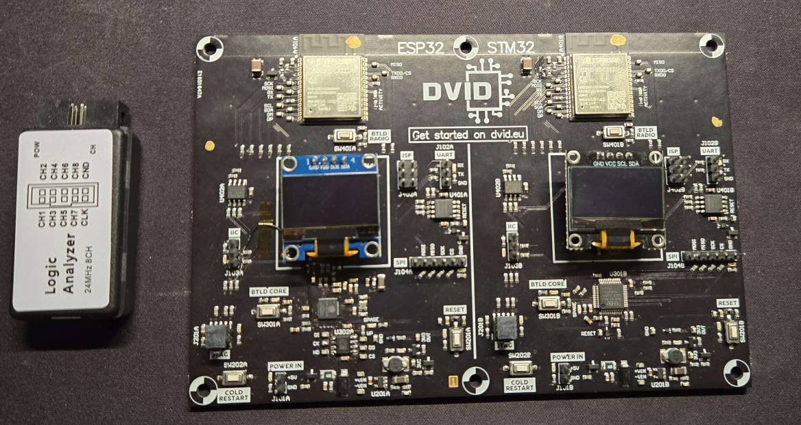

- A logic analyzer ✅
- Test probes ✅
- A DVID board pre-flashed with the challenge ✅

## 🔍 Step 1: Pin Identification
The first step is to correctly identify the pins mentioned in the description (PB10, PB11, PA6, and PA7) on the DVID board.

To do this, we need to consult the schematics of the DVID board. In the PDF document, the STM32 core documentation is on page 6. This is where we can identify the different pins of the microcontroller and their functions.

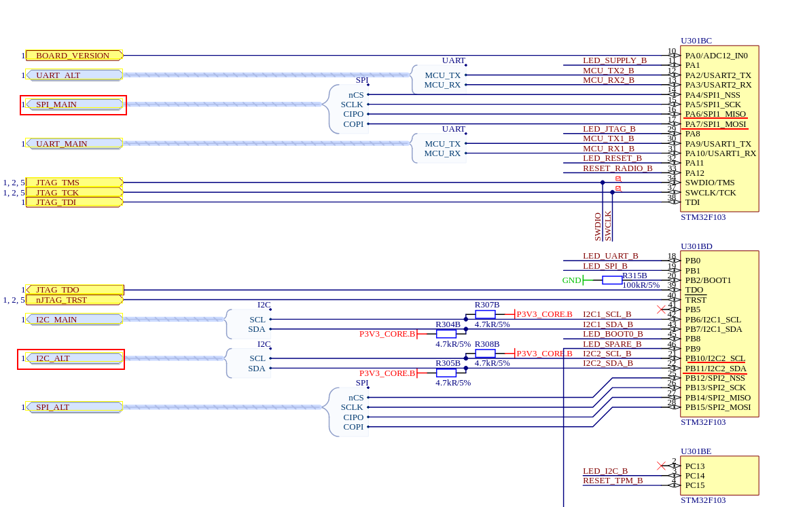

When examining the general schematic on page 1, we discover that the I2C_ALT and SPI_MAIN interfaces are connected to the peripheral (an ESP32-C6 module in our case). These interfaces are connected to AIR_I2C and AIR_SPI respectively.

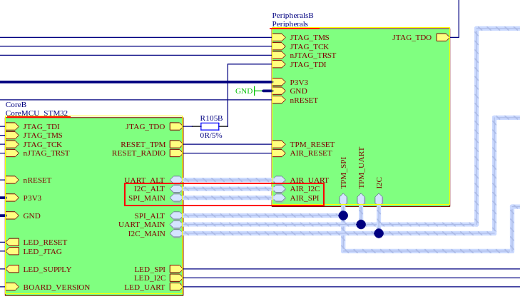

## 🔌 Step 2: Logic Analyzer Connection
On page 8 of the document, we find the detailed connections of this peripheral for the AIR_I2C and AIR_SPI interfaces.

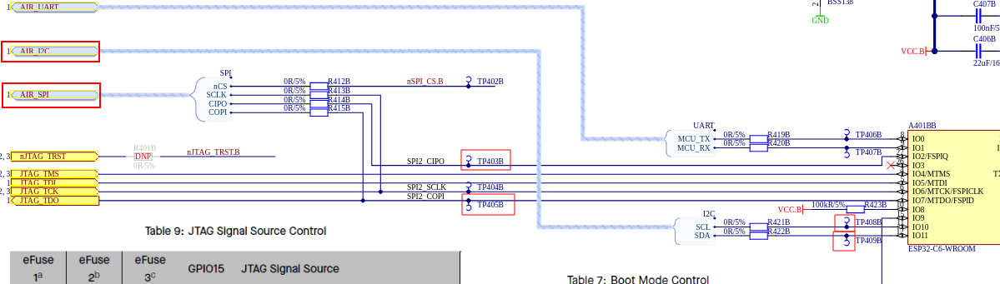

In this schematic, we can observe the different names of the pins to which we need to connect our logic analyzer. On the pin lines, there are different test points where we can make our connections.
 
📝 **Note**: On the schematics, the SPI interface is labeled SPI2_CIPO and SPI2_COPI (newer terminology), while on the board, it appears as SPI2_MISO and SPI2_MOSI.
 

We can now make the connections on the board as shown below:

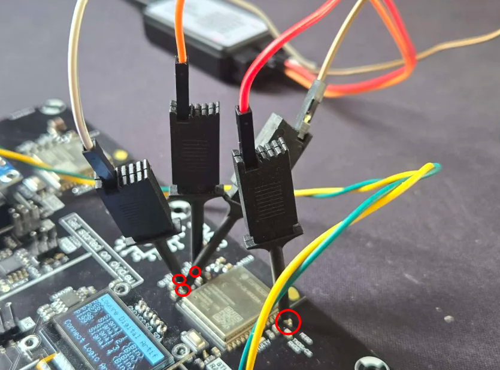
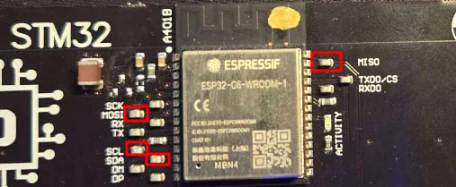

## 📊 Step 3: Analyzer Configuration and Decoding
Now that our logic analyzer is properly connected to the pins, we can start our analysis with the Saleae Logic software. If the wiring is correct, we should see the data being transmitted on the logic analyzer.
 
📝 **Note**: In this analysis, I used the same colors in Saleae as those of the wires used for the pin connections, to make it easier to understand.

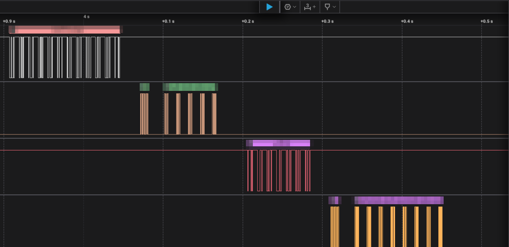

🧮 **Protocol Decoding**

According to the challenge description, the Egyptian priests used two distinct encoding methods:  
Horus' simple protocol (UART) and Anubis' complex encoding (Manchester).

To decode these protocols, we first need to determine the bit rate of the transmitted data.

According to the Saleae documentation, here's how to proceed:
1. Hover your mouse over the fastest 2 bits
2. Take the inverse of the measurement
3. An effective method is to find 2 data bits in opposite states to measure the distance between the two transitions

The software automatically displays these measurements as shown in the image below. In our case, the inverse measurement is 1.486 kHz, which is close to the bit rate of 1500 bits/s used by the device.

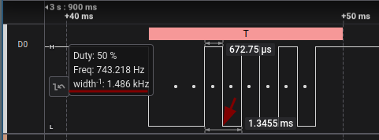

With this identified bit rate, we can now configure the protocol analyzer for UART:

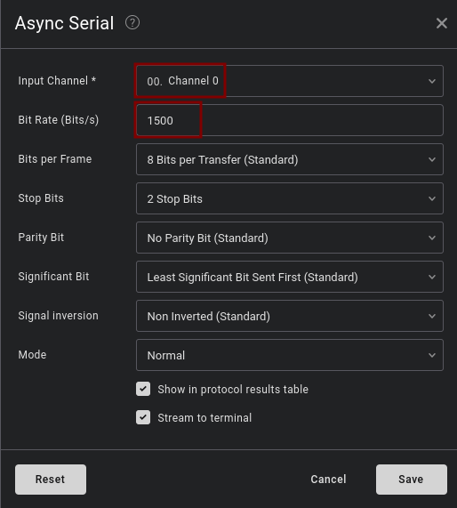

And also configure the protocol analyzer for Manchester:

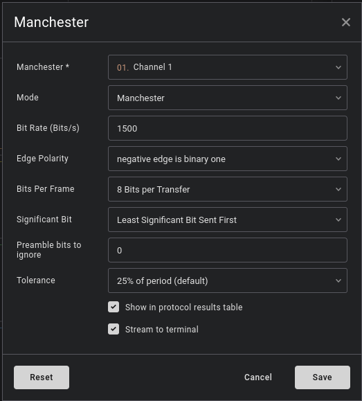

Perfect! Now, Saleae will do its job and decode everything for us:

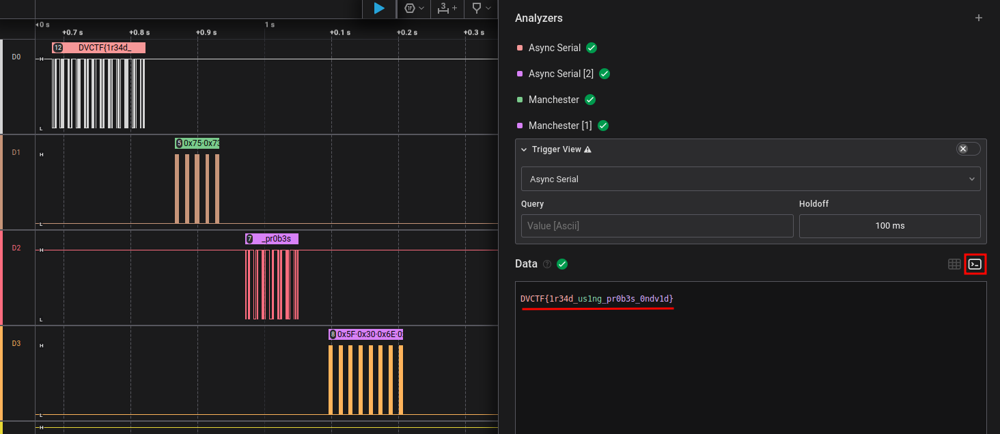

And there we have it! We can now validate the challenge with the discovered flag: 

🚩 `DVCTF{1r34d_us1ng_pr0b3s_0ndv1d}`

