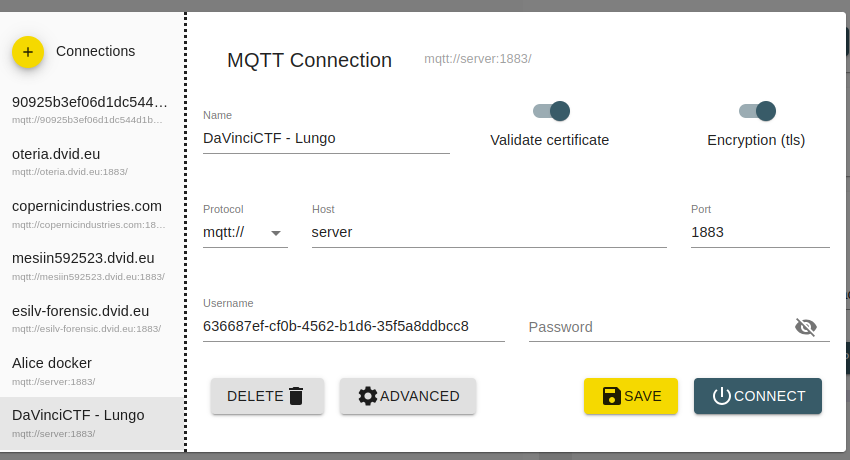
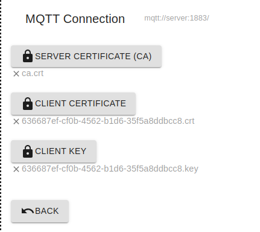
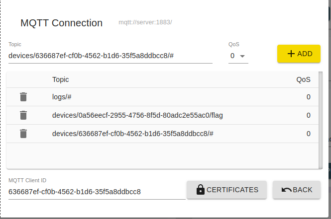
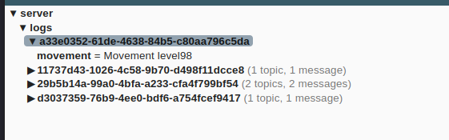
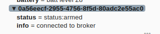
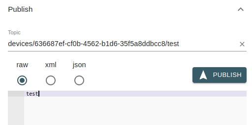
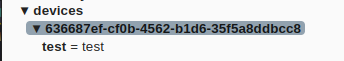
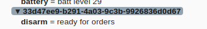
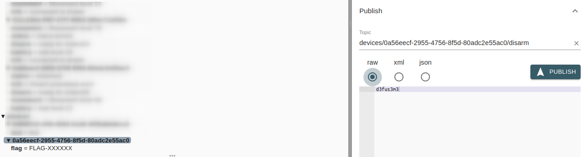

# Lungo Movement Detector - FR - Facile

Un détecteur de mouvement protège un sculture du louvre. L'outil, conçu par l'entreprise Lungo semble pouvoir être désactivé à distance. Vos récentes recherches ont montré que des informations intéressantes pouvaient être récupérées sur "logs" et "devices/[DEVICE]/flag" et que le mot de passe est : "d3fus3m3". Comme dans un jeu de carte, les jokers pourront vous aider, surtout que Lungo respecte les bonnes pratiques "policies".

Dans le cadre de votre cambriolage, le device 0a56eecf-2955-4756-8f5d-80adc2e55ac0 est installé.

Le serveur nécessite un certificat :
* [device.crt](./certs/636687ef-cf0b-4562-b1d6-35f5a8ddbcc8.crt)
* [device.key](./certs/636687ef-cf0b-4562-b1d6-35f5a8ddbcc8.key)
* [ca.crt](./certs/ca.crt)

/!\ Point d'attention : vous devez ajouter une entrée HOSTS pour le chiffrement TLS
```
cat /etc/hosts
172.17.0.2 server
```

# Lungo Movement Detector - EN - Easy
TODO


# Write-up

## Start connection with MQTT Explorer


## Configuration certs



## Configure Subscriptions


You can set jokers like # to get all level of topics

```Logs/#```
This subscription gets all logs messages from top topic logs




You can see that our target device is sending some logs




Try to subscribe to our device context

```devices/636687ef-cf0b-4562-b1d6-35f5a8ddbcc8/#```
This subscriptions gets all message from the user personnal topic. Indeed, there is a policy to restrict publication only on user context.
The certificate of the device CN is 636687ef-cf0b-4562-b1d6-35f5a8ddbcc8.






The message is well received by client because of the # joker is implemented on subscription configuration.

Let's subscribe to the flag topic (device 0a56eecf-2955-4756-8f5d-80adc2e55ac0)

```devices/0a56eecf-2955-4756-8f5d-80adc2e55ac0/flag```

After a quick review on logs, ```/disarm``` is waiting something :



Let's publish the password on ```devices/DEVICE/disarm``` topic. The flag is submitted only after publishing the password ```d3fus3m3```.



This behavior is due to misconfiguration on MQTT policies. Normally a device can't interact with another device.

```
user 636687ef-cf0b-4562-b1d6-35f5a8ddbcc8
topic read logs/#
topic read devices/0a56eecf-2955-4756-8f5d-80adc2e55ac0/flag
topic write devices/0a56eecf-2955-4756-8f5d-80adc2e55ac0/disarm

# All clients
pattern readwrite devices/%u/#
```
