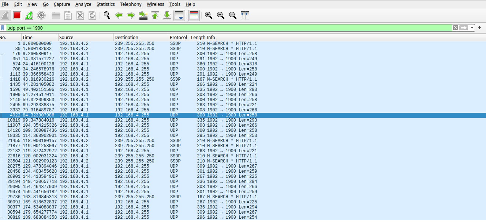
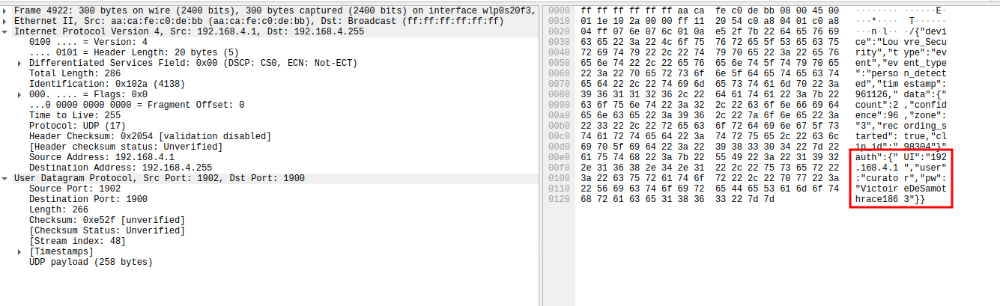
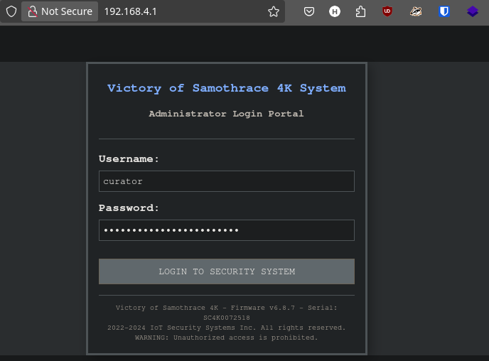
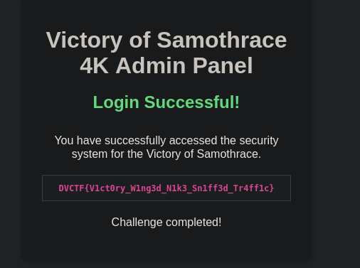

# DaVinciCTF - 🗿 Victory of Samothrace 

**Difficulty**: Very Easy<br>
**Category**: Hardware<br>
**Description:** Suspicious behavior has been detected around the Winged Victory of Samothrace, the Hellenistic masterpiece representing the goddess Nike. A new wireless security system has been installed to monitor this priceless sculpture dating back to the 2nd century BC.<br>

Our teams have noticed unusual Wi-Fi transmissions coming from the security device. We suspect a configuration issue by the administrator: information about the device might be circulating in plain text on the network.<br>

Your mission: capture and analyze the network traffic emitted by the access point "C_LOUVRE_Security_System_6.8.7" in order to intercept the administrator credentials.<br>

The preservation of our national treasures depends on your expertise in packet sniffing. The Wi-Fi password is `L0uvr3_W1F1`.<br>

- [📡 Step 1: Network Reconnaissance](#📡-step-1-network-reconnaissance)
- [🔍 Step 2: Packet Analysis](#🔍-step-2-packet-analysis)
- [🔐 Step 3: Web Interface Access](#🔐-step-3-web-interface-access)

For this challenge, each team received:
- A DVID board pre-flashed with the challenge ✅

## 📡 Step 1: Network Reconnaissance

The first step is to connect to the wireless network mentioned in the challenge description.

```bash
SSID: C_LOUVRE_Security_System_6.8.7
Password: L0uvr3_W1F1
```

After successfully connecting to the network, we need to capture and analyze the network traffic to identify any suspicious communications. For this purpose, we'll use Wireshark.

## 🔍 Step 2: Packet Analysis

With Wireshark running, we begin analyzing the network traffic. After a brief observation, we notice unusual UDP broadcast traffic on port 1900:



Port 1900, here is being used to broadcast what appears to be telemetry data. This is highly unusual on a WiFi 
network.

Upon examining the packet contents, we discover something interesting. The system is broadcasting telemetry data in plaintext JSON format:



The JSON payload contains three critical pieces of information: webui address, username and password.

## 🔐 Step 3: Web Interface Access

With the discovered credentials and web UI address, we can now attempt to access the security system's administrative interface:

```
URL: http://192.168.4.1
Username: curator
Password: VictoireDeSamothrace1863
```

Navigating to the URL, we're presented with the login interface for the Samothrace's security system:



Using the credentials we intercepted from the network traffic, we successfully authenticate and gain access to the administrative panel.

The interface reveals a message containing our flag:



🚩 `DVCTF{V1ct0ry_W1ng3d_N1k3_Sn1ff3d_Tr4ff1c}`

